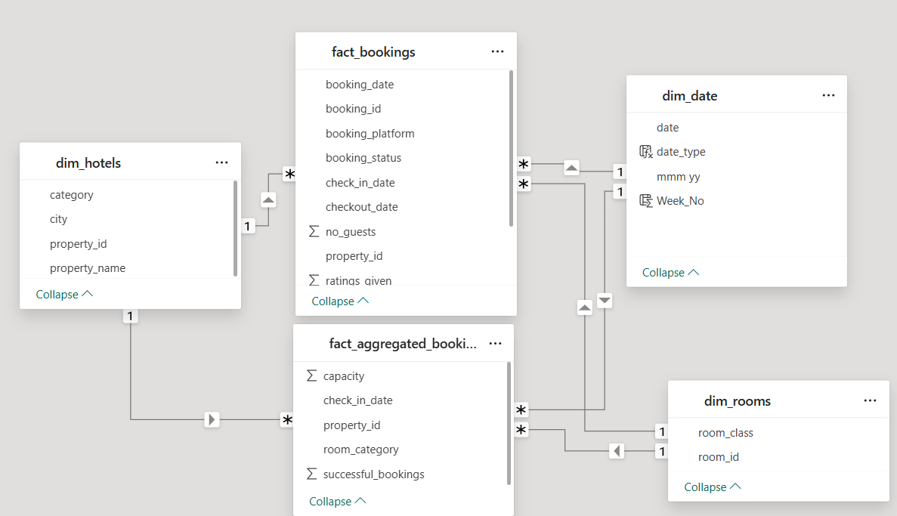

# Hospitality Analysis Challenge 

## Problem Statement
Atliq Grands owns multiple five-star hotels across India. They have been in the hospitality industry for the past 20 years. Due to strategic moves from other competitors and ineffective decision-making in management, Atliq Grands are losing its market share and revenue in the luxury/business hotels category. As a strategic move, the managing director of Atliq Grands wanted to incorporate “Business and Data Intelligence” in order to regain their market share and revenue. However, they do not have an in-house data analytics team to provide them with these insights.

Their revenue management team had decided to hire a 3rd party service provider to provide them insights from their historical data.

## Data Model

## Some Important insights from the Dashboard
- Developed 2 Dashboards for Overall Analysis and Booking Analysis
- The analysis is done on various parameters to give a proper insight from the requirement mentioned by the revenue team.
- There is  Strong positive correlation between property ratings and occupancy rates indicates that guests heavily rely on reviews when booking.
-  Flat ADR(Average Daily Rate) trends suggest limited use of dynamic pricing models across properties.They are following flat pricing.
-  ADR is consistently lower on properties’ own online booking platform compared to third-party booking channels, highlighting pricing strategy gaps.
- We need to focus more on Elite customers across the cities as they drive the revenue boost. RT2 Room type should be prioritized more as it has the highest   influence on revenue.
- Mumbai generates the highest revenue (669 M) followed by Bangalore, Hyderabad and Delhi
- AtliQ Exotica performs better compared to all 7 type of properties with 320 Million revenue, rating 3.62, occupancy percentage is 57 and cancellation rate as 24.4%.
- AtliQ Blu has the highest occupancy of 62%
- Week 27 recorded the highest revenue among all, which is 139.73 Million
- Elite type rooms has the most booking and as well higher cancellation rate
